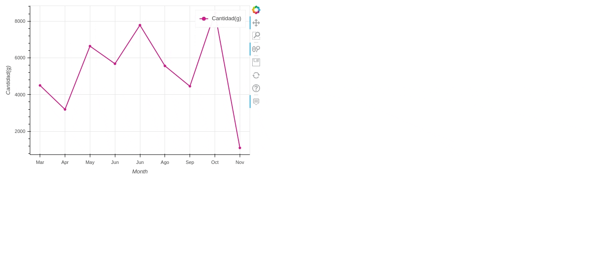

# Birds Dashboard made with Pandas and Bokeh
This is a project to try pandas_bokeh for Dashboards.
I am following data about fruits the birds come to eat in my window 🐦.

## Requirements and Installation

## Data

I have been collecting data from the quantity of fruit I put in my window every day. A lot of birds come to eat it and I love it!   
This is [the post](http://tangaritas.com/que-tanto-comen-las-aves-que-llegan-a-mi-ventana/) I wrote about it.

I am registering [this data](https://docs.google.com/spreadsheets/d/1dENiPTJtdqOiU9Oiwxen2UU2K4HP1jOR_MyGcjQP81k/edit#gid=884902643) every day when I put fruit in my window. I do it in a Google Sheets app on my cell phone.

## Jupyter Notebook

[To run complete notebook](https://mybinder.org/v2/gh/isabelyb/bokeh_birds_dashboard/33b532b364cd93f007d6141b5b233df735b7f3f1?filepath=birds_dashboard.ipynb)

## Issues

## References

